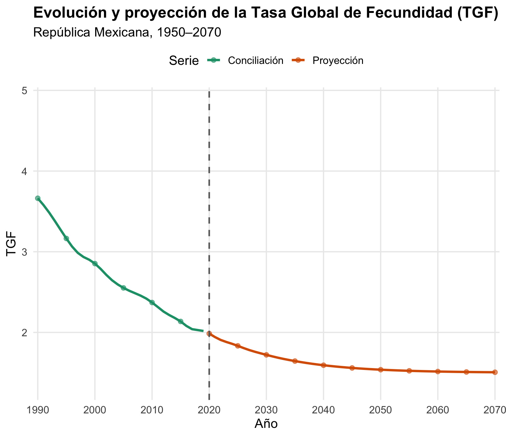

# Laboratorio 2 - Fecundidad

Documentación de los archivos 

- `1_bilogito.xlsx` contiene los datos necesarios para el ajuste al modelo bilogito.
- `2_projection.R` es un script en R diseñado para utilizar el ajuste bilogito de la TGF y proyectarla fuera de los años de conciliació (2020-2050).
- `data/tgf_proy.csv` son los datos de la proyección de la serie de tiempo con ARIMA en `2_projection.R`
- `3_final_projection.xlsx` utiliza los datos de la proyección de la TGF para proyectar la población fuera de los años de conciliación.

